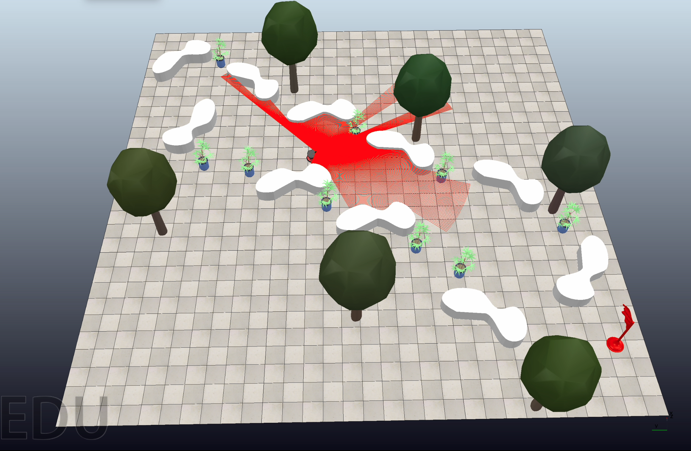
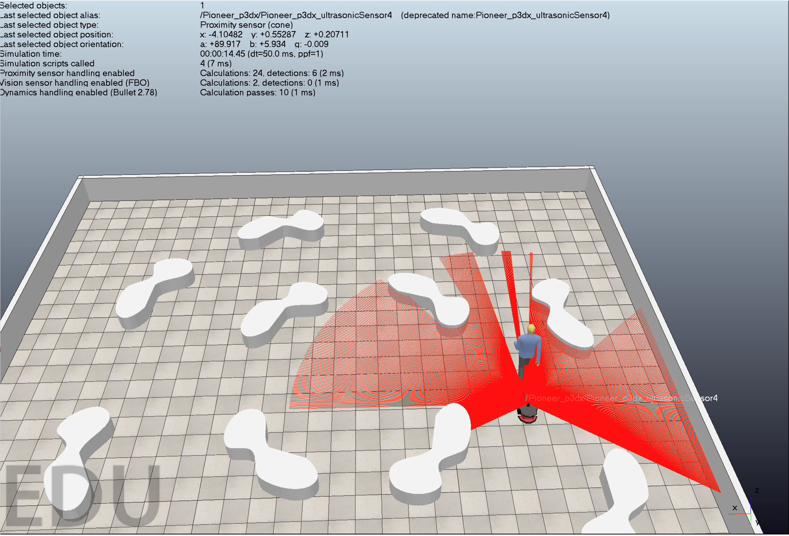
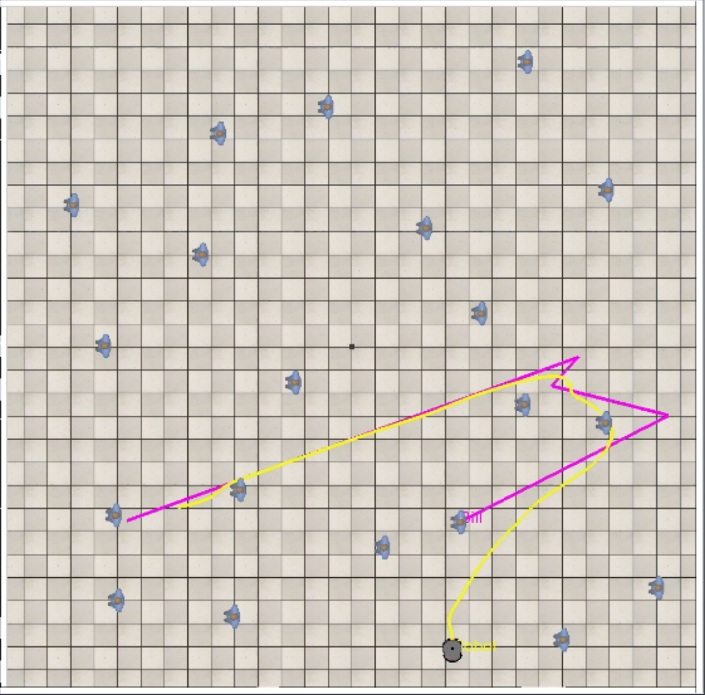
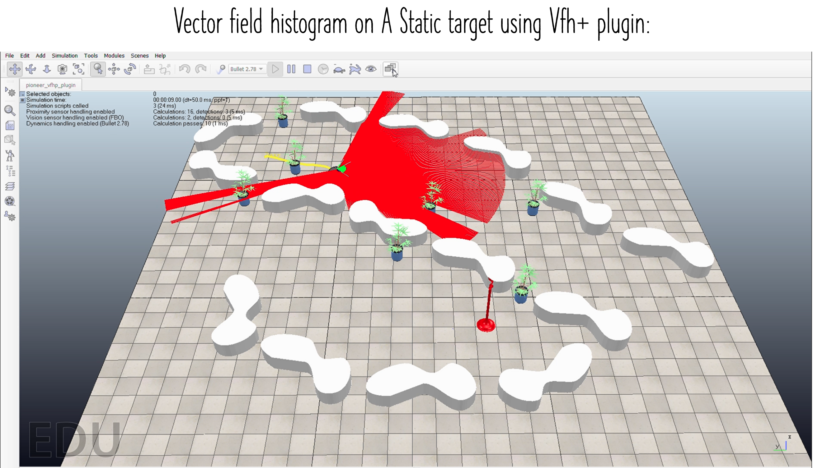
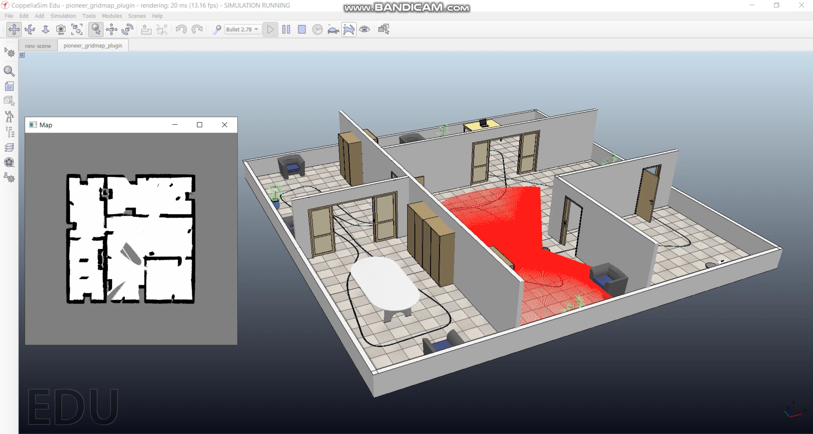

# CSCI6350: Intelligent Agents - Personal Repository

Welcome to my personal GitLab repository for the Intelligent Agents course (CSCI6350). This repository is dedicated to my coursework submissions and interactions with Professor Dr. Abdullah Al Redwan Newaz.

## Student Details

- Name: Padam Jung Thapa
- Student ID: 2623560
- Course: CSCI6350 - Intelligent Agents 

## Repository Structure

This repository is organized into several folders, each designated for specific types of submissions.

Some Sample Experiments Plots:

 

